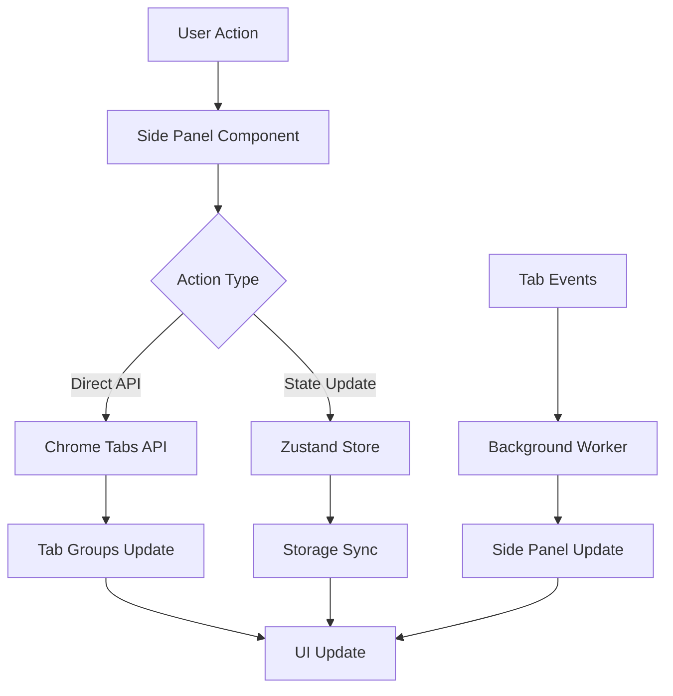

# Architecture Overview

## System Structure

TabQuest is built on Chrome Extension Manifest V3 with the WXT framework, utilizing the Chrome Side Panel API for a modern, persistent user interface.

## Core Components

### 1. Entry Points

#### Side Panel (`sidepanel.tsx`)
- **Role**: Main user interface via Chrome Side Panel API
- **Key Features**:
  - Persistent side panel UI
  - Resizable width
  - Always visible alongside browsing
  - Responsive layout with glass morphism design
  - Requires Chrome 114+

#### Background Service Worker (`background.ts`)
- **Role**: Background logic processing
- **Key Features**:
  - Extension lifecycle management
  - Message handling between components
  - Side panel activation on icon click
  - Event coordination

```typescript
// Message handler structure
chrome.action.onClicked.addListener(() => {
  chrome.sidePanel.open({ windowId: getCurrentWindowId() });
});
```

#### Popup Component (`popup-component.tsx`)
- **Role**: Shared UI component used in side panel
- **Key Features**:
  - Tab state display
  - AI insight cards
  - Smart organization triggers
  - Category management interface

### 2. State Management

#### Store Architecture
```typescript
// categoryStore.ts
interface CategoryStore {
  categories: Category[]
  categoryMapping: Record<string, string>
  loadCategories: () => Promise<void>
  addCategory: (category: Category) => Promise<void>
  updateCategory: (id: string, updates: Partial<Category>) => Promise<void>
  deleteCategory: (id: string) => Promise<void>
  setCategoryMapping: (domain: string, categoryId: string) => Promise<void>
  getCategoryForDomain: (domain: string) => string
  reorderCategories: (startIndex: number, endIndex: number) => Promise<void>
}

// aiStore.ts
interface AIStore {
  insights: AIInsight[]
  addInsight: (insight: AIInsight) => void
  removeInsight: (id: string) => void
  clearInsights: () => void
}
```

### 3. Data Flow



## Core Algorithms

### Tab Organization Algorithm

1. **Domain Extraction**: Extract hostname from URL and normalize
2. **Category Matching**:
   - User-defined mapping priority
   - Category domain list check
   - Subdomain pattern matching
   - Default to 'uncategorized'
3. **Group Creation**:
   - Ungroup all existing tab groups
   - Reorder tabs by category sequence
   - Create Chrome Tab Groups with colors and names

### Smart Organization Flow

```typescript
// Organization process
1. Query all tabs in current window
2. Analyze tab distribution and patterns
3. Detect duplicates and anomalies
4. Categorize tabs by domain
5. Create optimal tab groups
6. Generate AI insights
7. Create snapshot for undo
```

## Storage Structure

### Chrome Storage Sync
- `categories`: User-defined category list
- `categoryMapping`: Domain → Category mappings
- `language`: Selected language preference
- `hasSeenWelcome`: First-time user flag

### Chrome Storage Local
- `snapshots`: Saved tab states
- `aiInsights`: AI-generated insights
- `undoStack`: Undo history (in-memory)

## Performance Optimizations

### 1. Direct Chrome API Usage
- No background script intermediary for tab operations
- Immediate response through direct API calls
- `organizeTabsDirectly()` function for instant tab manipulation

### 2. Efficient State Management
- Zustand selective subscriptions prevent unnecessary re-renders
- Memoization for expensive calculations
- State consolidation reduces update overhead

### 3. Side Panel Benefits
- Persistent UI without repeated initialization
- Lower memory footprint than popup
- Better user experience with always-on access

### 4. Component Optimization
- React.memo for list items
- useCallback for stable function references
- useMemo for computed values
- Custom hooks for logic separation

## Security Considerations

1. **Manifest V3 Compliance**
   - Service Worker architecture
   - Content Security Policy enforcement
   - No remote code execution

2. **Permission Minimization**
   - Only essential permissions requested
   - No host permissions required
   - Local-only data storage

3. **Data Protection**
   - No sensitive information stored
   - Local storage only (no external sync)
   - Browser security model reliance

## Architecture Patterns

### 1. Component Hierarchy
```
Side Panel
├── PopupComponent (main container)
│   ├── CategoryManager
│   │   └── CategoryItem (memoized)
│   ├── TabList
│   │   └── TabListItem (memoized)
│   ├── AIInsightCard
│   └── Modals
│       ├── HelpModal
│       ├── TabGroupsModal
│       └── CategoryEditModal
```

### 2. Custom Hooks
- `useSmartOrganize`: Organization logic and state
- `useInsightsGenerator`: AI insight generation
- Hook-based separation of concerns

### 3. Utility Layer
- `unifiedOrganizer`: Core organization logic
- `undoManager`: Undo/redo state management
- `snapshotStorage`: Tab state persistence
- `chromeTabHelpers`: Chrome API wrappers
- `storage`: Storage abstraction layer

## Technology Stack

- **Framework**: WXT (Web Extension Tools)
- **UI Library**: React 18
- **State**: Zustand
- **UI Surface**: Chrome Side Panel API
- **Styling**: Tailwind CSS
- **i18n**: i18next + react-i18next
- **Build**: Vite + TypeScript
- **Manifest**: V3

## Extension Lifecycle

1. **Installation**: Initialize default categories
2. **Startup**: Load user preferences and state
3. **Runtime**:
   - Monitor tab events
   - Update side panel UI
   - Process user actions
4. **Update**: Preserve user data, migrate if needed
5. **Uninstall**: Chrome handles cleanup
